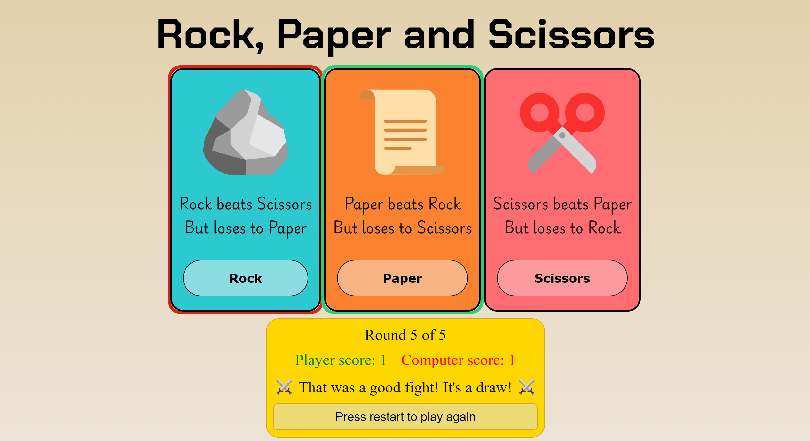

# Rock Paper Scissors
*Rock Paper Scissors* game project from [The Odin Project](https://www.theodinproject.com/about) course

## Preview link
https://yurii-ruban.github.io/top-rock-paper-scissors

## Skills
 - Javascript basics
    * Working with primitive data types (strings, numbers)
    * Working fith function definitions and functional objects (arrow functions)
    * Working with simple loops and conditional statements

- DOM manipulation
    * Creating and removing elements
    * Creating and handling custom events
    * Applying styles using Javascript

## Purpose
The Rock Paper Scisors game presents the ability and understanding the very basic foundation of Js programming. It is done for studying purposes

## Screenshot

